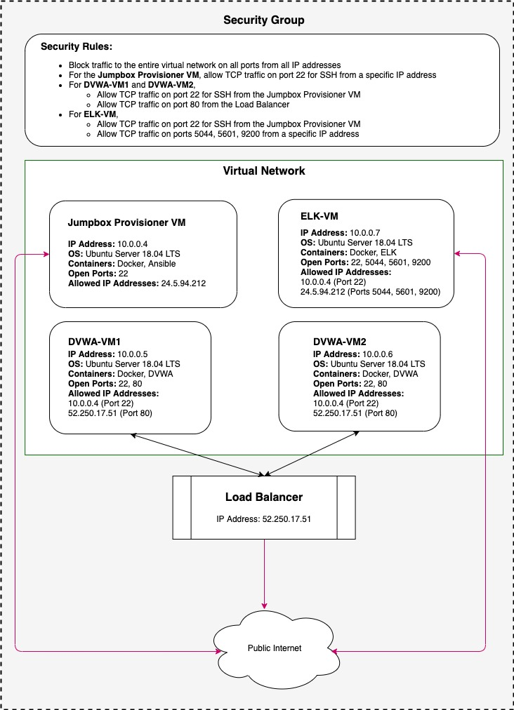
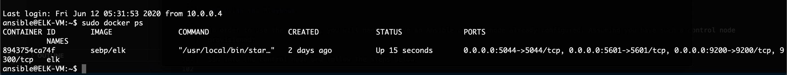

# Cybersecurity-Course

This repository contain files from the UC Berkeley Cybersecurity Program.

## Automated ELK Stack Deployment

The files in this repository were used to configure the network depicted below.

These files have been tested and used to generate a live ELK deployment on Azure. They can be used to either recreate the entire deployment pictured above. Alternatively, select portions of the [Filebeat Playbook](Ansible/filebeat-playbook.yml) file may be used to install only certain pieces of it, such as Filebeat.

- [ELK Playbook](Ansible/install-elk.yml)

This document contains the following details:

- Description of the Topology
- Access Policies
- ELK Configuration
  - Beats in Use
  - Machines Being Monitored
- How to Use the Ansible Build

### Description of the Topology

The main purpose of this network is to expose a load-balanced and monitored instance of DVWA, the D*mn Vulnerable Web Application.

Load balancing ensures that the application will be highly available, in addition to restricting access to the network.

- By routing the traffic among the servers, a load balancer will make sure that there will not be a single point of application failure.
- A jump box is a secure, hardened virtual machines that is used to access and manage other devices in a separate security zone.

Integrating an ELK server allows users to easily monitor the vulnerable VMs for changes to the system configuration.

- Filebeat watches and monitors the specified log files or locations and forwards them to Elasticsearch or Logstash for indexing.
- Metricbeat records metrics from the operating system and services running on the server periodically and ships them to a specified output.

The configuration details of each machine may be found below.

| Name                | Function   | IP Address | Operating System        |
|---------------------|------------|------------|-------------------------|
| Jumpbox Provisioner | Gateway    | 10.0.0.4   | Ubuntu Server 18.04 LTS |
| DVWA-VM1            | Web Server | 10.0.0.5   | Ubuntu Server 18.04 LTS |
| DVWA-VM2            | Web Server | 10.0.0.6   | Ubuntu Server 18.04 LTS |
| ELK-VM              | ELK Server | 10.0.0.7   | Ubuntu Server 18.04 LTS |

### Access Policies

The machines on the internal network are not exposed to the public Internet.

Only the Jumpbox Provisioner machine can accept connections from the Internet. Access to this machine is only allowed from the following IP addresses:

- 24.5.94.212

Machines within the network can only be accessed by the Jump Box machine using SSH.

- We allowed only the Jumpbox Provisioner (IP Address: 10.0.0.4) the ability to SSH into the ELK server.

A summary of the access policies in place can be found in the table below.

| Name                | Publicly Accessible | Allowed IP Addresses  |
|---------------------|---------------------|-----------------------|
| Jumpbox Provisioner | Yes                 | 24.5.94.212           |
| DVWA-VM1            | No                  | 10.0.0.4              |
| DVWA-VM2            | No                  | 10.0.0.4              |
| ELK-VM              | No                  | 10.0.0.4, 24.5.94.212 |

### ELK Configuration

Ansible was used to automate configuration of the ELK machine. No configuration was performed manually, which is advantageous because we can use it to configure resources across multiple machines from a single platform.

The playbook implements the following tasks:

- Installs Docker
- Installs Pip
- Installs the Docker Python module
- Increases the virtual memory of the system
- Downloads and launches a Docker ELK container

The following screenshot displays the result of running `docker ps` after successfully configuring the ELK instance.

### Target Machines & Beats

This ELK server is configured to monitor the following machines:

- 10.0.0.5
- 10.0.0.6

We have installed the following Beats on these machines:

- System log

### Using the Playbook

In order to use the playbook, you will need to have an Ansible control node already configured. Assuming you have such a control node provisioned:

SSH into the control node and follow the steps below:

- Copy the [filebeat-cfg.yml](Ansible/filebeat-cfg.yml) file to `/etc/filebeat/filebeat.yml`.
- Update the `/etc/ansible/hosts` file to include the IP addresses of the web servers under `[webservers]` and the IP address of the ELK server under `[elkservers]`.
- Run the playbook, and navigate to [http://52.175.246.101:5601](http://52.175.246.101:5601) to check that the installation worked as expected.
